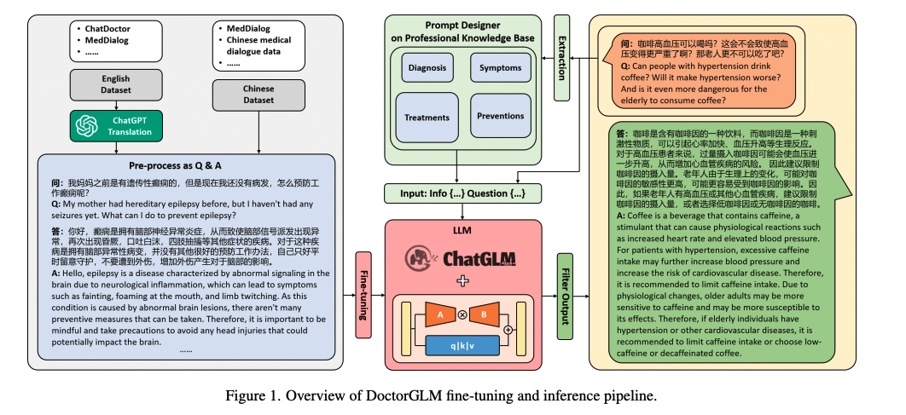

# Vision-language models

## Model

### PMC-VQA: Visual Instruction Tuning for Medical Visual Question Answering [[paper]](https://arxiv.org/pdf/2305.10415.pdf) [[repo]](https://xiaoman-zhang.github.io/PMC-VQA/)

### LLaVA: Visual Instruction Tuning [[paper]](https://arxiv.org/pdf/2304.08485.pdf) [[repo]](https://llava-vl.github.io/)

### LLaVA-vl: Improved Baselines with Visual Instruction Tuning [[paper]](https://arxiv.org/pdf/2310.03744.pdf) [[repo]](https://llava-vl.github.io/)

### LLaVA-Med: Training a Large Language-and-Vision Assistant for Biomedicine in One Day [[paper]](https://arxiv.org/pdf/2306.00890.pdf) [[model]](https://aka.ms/llava-med)

### CLIP: Learning Transferable Visual Models From Natural Language Supervision [[paper]](https://arxiv.org/pdf/2103.00020.pdf) [[repo]](https://github.com/OpenAI/CLIP) 

### MedCLIP: Contrastive Learning from Unpaired Medical Images and Text [[paper]](https://arxiv.org/pdf/2210.10163.pdf) [[repo]](https://github.com/RyanWangZf/MedCLIP)

### Q2ATransformer: Improving Medical VQA via an Answer Querying Decoder [[paper]](https://arxiv.org/pdf/2304.01611.pdf)

### Flamingo: a Visual Language Model for Few-Shot Learning [[paper]](https://arxiv.org/pdf/2204.14198.pdf) 

### OpenFlamingo: An Open-Source Framework for Training Large Autoregressive Vision-Language Models [[paper]](https://arxiv.org/pdf/2308.01390.pdf) [[repo]](https://github.com/mlfoundations/open_flamingo) [[huggingface]](https://huggingface.co/openflamingo/OpenFlamingo-3B-vitl-mpt1b)

### InstructBLIP: Towards General-purpose Vision-Language Models with Instruction Tuning [[paper]](https://arxiv.org/pdf/2305.06500.pdf) [[repo]](https://github.com/salesforce/LAVIS/tree/main/projects/instructblip)

### PubMedCLIP: How Much Does CLIP Benefit Visual Question Answering in the Medical Domain? [[paper]](https://aclanthology.org/2023.findings-eacl.88.pdf) [[repo]](https://github.com/sarahESL/PubMedCLIP)

### CXR-CLIP: Toward Large Scale Chest X-ray Language-Image Pre-training [[paper]](https://arxiv.org/pdf/2310.13292.pdf) [[repo]](https://github.com/kakaobrain/cxr-clip)

### JPG - Jointly Learn to Align: Automated Disease Prediction and Radiology Report Generation [[paper]](https://aclanthology.org/2022.coling-1.523.pdf)

### PromptMRG: Diagnosis-Driven Prompts for Medical Report Generation [[paper]](https://arxiv.org/pdf/2308.12604.pdf)

### DoctorGLM: Fine-tuning your Chinese Doctor is not a Herculean Task [[paper]](https://arxiv.org/pdf/2304.01097.pdf) [[repo]](https://github.com/xionghonglin/DoctorGLM)

### XrayGPT: Chest Radiographs Summarization using Large Medical Vision-Language Models [[paper]](https://arxiv.org/pdf/2306.07971.pdf) [[repo]](https://github.com/mbzuai-oryx/XrayGPT)

### Radiology-GPT: A Large Language Model for Radiology [[paper]](https://arxiv.org/pdf/2306.08666.pdf) [[huggingface]](https://huggingface.co/spaces/allen-eric/radiology-gpt)

### MiniGPT-4: Enhancing Vision-Language Understanding with Advanced Large Language Models [[paper]](https://arxiv.org/abs/2304.10592) [[web]](https://minigpt-4.github.io/)

### MiniGPT-v2: large language model as a unified interface for vision-language multi-task learning [[paper]](https://minigpt-v2.github.io/)

- LLaMA2 + ViT with multi-task instruction tuning

### RWKV: Reinventing RNNs for the Transformer Era [[paper]](https://arxiv.org/abs/2305.13048) [[web]](https://wiki.rwkv.com/)

- RNN with Transformer

### M-FLAG: Medical Vision-Language Pre-training with Frozen Language Models and Latent Space Geometry Optimization [[paper]](https://arxiv.org/pdf/2307.08347.pdf) [[repo]](https://github.com/cheliu-computation/M-FLAG-MICCAI2023)

### Vision-Language Modelling for Radiological Imaging and Reports in the Low Data Regime [[paper]](https://arxiv.org/pdf/2303.17644.pdf) 

### CAMANet: Class Activation Map Guided Attention Network for Radiology Report Generation [[paper]](https://arxiv.org/pdf/2211.01412.pdf)

### KiUT: Knowledge-injected U-Transformer for Radiology Report Generation [[paper]](https://openaccess.thecvf.com/content/CVPR2023/papers/Huang_KiUT_Knowledge-Injected_U-Transformer_for_Radiology_Report_Generation_CVPR_2023_paper.pdf)

### Replace and Report: NLP Assisted Radiology Report Generation [[paper]](https://arxiv.org/pdf/2306.17180.pdf)

### ChatRadio-Valuer: A Chat Large Language Model for Generalizable Radiology Report Generation Based on Multi-institution and Multi-system Data [[paper]](https://arxiv.org/pdf/2310.05242.pdf)

### K-PathVQA: Knowledge-Aware Multimodal Representation for Pathology Visual Question Answering [[paper]](https://ieeexplore.ieee.org/abstract/document/10177927?casa_token=_22BcWB2WNIAAAAA:XXGST5ZAg_pfDSlx9PwDWZd1uFBmxd8PCIBFmtDHv38byw7fuTNI4CBrtA5XL6nIDYtw78Etwg)

### What Matters in Training a GPT4-Style Language Model with Multimodal Inputs? [[paper]](https://arxiv.org/pdf/2307.02469.pdf)

### MedAlpaca: [[repo]](https://github.com/kbressem/medAlpaca)

### PMC-LLaMA: Towards Building Open-source Language Models for Medicine [[paper]](https://arxiv.org/abs/2304.14454) [[repo]](https://github.com/)

#### LARGE-SCALE DOMAIN-SPECIFIC PRETRAINING FOR BIOMEDICAL VISION-LANGUAGE PROCESSING [[paper]](https://arxiv.org/pdf/2303.00915.pdf)

### Open-Ended Medical Visual Question Answering Through Prefix Tuning of Language Models [[paper]](https://arxiv.org/pdf/2303.05977.pdf)

### SELF-SUPERVISED VISION-LANGUAGE PRETRAINING FOR MEDIAL VISUAL QUESTION ANSWERING [[paper]](https://arxiv.org/pdf/2211.13594.pdf)

### Vision–Language Model for Visual Question Answering in Medical Imagery[[paper]](https://www.ncbi.nlm.nih.gov/pmc/articles/PMC10045796/)

### Shikra: Unleashing Multimodal LLM’s Referential Dialogue Magic [[paper]](https://arxiv.org/pdf/2306.15195.pdf) [[repo]](https://github.com/shikras/shikra)

### DetGPT: Detect What You Need via Reasoning [[paper]](https://arxiv.org/pdf/2305.14167.pdf) [[web]](https://detgpt.github.io/)

### RoentGen: Vision-Language Foundation Model for Chest X-ray Generation [[paper]](https://arxiv.org/pdf/2211.12737.pdf) 

### Multimodal Image-Text Matching Improves Retrieval-based Chest X-Ray Report Generation [[paper]](https://arxiv.org/pdf/2303.17579.pdf) [[repo]](https://github.com/rajpurkarlab/X-REM)

### Clinical-BERT: Vision-Language Pre-training for Radiograph Diagnosis and Reports Generation[[paper]](https://ojs.aaai.org/index.php/AAAI/article/view/20204)

### MEDICAL IMAGE UNDERSTANDING WITH PRETRAINED VISION LANGUAGE MODELS: A COMPREHENSIVE STUDY [[paper]](https://arxiv.org/pdf/2209.15517.pdf) [[repo]](https://github.com/MembrAI/MIU-VL)

### Multimodal medical tensor fusion network-based DL framework for abnormality prediction from the radiology CXRs and clinical text reports [[paper]](https://link.springer.com/article/10.1007/s11042-023-14940-x)

### From Chest X-Rays to Radiology Reports: A Multimodal Machine Learning Approach [[paper]](https://ieeexplore.ieee.org/document/8945819)

### Medical image captioning via generative pretrained transformers [[paper]](https://www.nature.com/articles/s41598-023-31223-5)

### Utilizing Synthetic Data for Medical Vision-Language Pre-training: Bypassing the Need for Real Images [[paper]](https://arxiv.org/pdf/2310.07027.pdf)

### Generalized Radiograph Representation Learning via Cross-supervision between Images and Free-text Radiology Reports [[paper]](https://arxiv.org/pdf/2111.03452.pdf)

### RATCHET: Medical Transformer for Chest X-ray Diagnosis and Reporting [[paper]](https://arxiv.org/pdf/2107.02104.pdf) [[repo]](http://www.github.com/farrell236/RATCHET)

### Automated Generation of Accurate & Fluent Medical X-ray Reports [[paper]](https://aclanthology.org/2021.emnlp-main.288.pdf) [[repo]](https://github.com/ginobilinie/xray_report_generation)

### Attributed Abnormality Graph Embedding for Clinically Accurate X-Ray Report Generation [[paper]](https://arxiv.org/pdf/2207.01208.pdf)

### mPLUG-Owl : Modularization Empowers Large Language Models with Multimodality [[paper]](https://arxiv.org/pdf/2304.14178.pdf) [[repo]](https://github.com/X-PLUG/mPLUG-Owl)

### Xplainer: From X-Ray Observations to Explainable Zero-Shot Diagnosis [[paper]](https://arxiv.org/pdf/2303.13391.pdf)

### Text-Guided Foundation Model Adaptation for Pathological Image Classification [[paper]](https://link.springer.com/chapter/10.1007/978-3-031-43904-9_27)

## Factual correctness

### Optimizing the Factual Correctness of a Summary: A Study of Summarizing Radiology Reports [[paper]](https://arxiv.org/pdf/1911.02541v3.pdf)

### Improving Factual Completeness and Consistency of Image-to-Text Radiology Report Generation [[paper]](https://arxiv.org/pdf/2010.10042.pdf)

### Improving Radiology Report Generation Systems by Removing Hallucinated References to Non-existent Priors [[paper]](https://arxiv.org/pdf/2210.06340.pdf)

### Fact-Checking of AI-Generated Reports [[paper]](https://arxiv.org/pdf/2307.14634.pdf)

## Multi-view:

### IIHT: Medical Report Generation with Image-to-Indicator Hierarchical Transformer [[paper]](https://arxiv.org/pdf/2308.05633.pdf)

### C2M-DoT: Cross-modal consistent multi-view medical report generation with domain transfer network [[paper]](https://arxiv.org/pdf/2310.05355.pdf)

- also published as MVCO-DOT: MULTI-VIEW CONTRASTIVE DOMAIN TRANSFER NETWORK FOR MEDICAL REPORT GENERATION [[paper]](https://arxiv.org/pdf/2304.07465.pdf)

### UniXGen: A Unified Vision-Language Model for Multi-View Chest X-ray Generation and Report Generation [[paper]](https://arxiv.org/pdf/2302.12172.pdf)

### Automated Generation of Accurate & Fluent Medical X-ray Reports [[paper]](https://aclanthology.org/2021.emnlp-main.288.pdf) [[repo]](https://github.com/ginobilinie/xray_report_generation)

## Good survey papers:

A Survey of Large Language Models [[paper]](https://arxiv.org/pdf/2303.18223.pdf)

FOUNDATIONAL MODELS IN MEDICAL IMAGING: A COMPREHENSIVE SURVEY AND FUTURE VISION [[paper]]((https://arxiv.org/pdf/2310.18689.pdf))

Instruction Tuning for Large Language Models: A Survey [[paper]](https://arxiv.org/pdf/2308.10792.pdf)

Pre-trained Language Models in Biomedical Domain: A Systematic Survey [[paper]](https://dl.acm.org/doi/10.1145/3611651)

Multimodal Foundation Models: From Specialists to General-Purpose Assistants [[paper]](https://arxiv.org/pdf/2309.10020.pdf) 

## Evaluation

### Multimodal ChatGPT for Medical Applications: an Experimental Study of GPT-4V [[paper]](https://arxiv.org/pdf/2310.19061.pdf) [[repo]](https://github.com/ZhilingYan/GPT4V-Medical-Report)

- Evaluation GPT4v for medical domain 

### MME: A Comprehensive Evaluation Benchmark for Multimodal Large Language Models [[paper]](https://arxiv.org/pdf/2306.13394.pdf)

### Foundation Metrics: Quantifying Effectiveness of Healthcare Conversations powered by Generative AI [[paper]](https://arxiv.org/pdf/2309.12444.pdf)

### Evaluating large language models for use in healthcare: A framework for translational value assessment [[paper]](https://www.sciencedirect.com/science/article/pii/S2352914823001508)

### Faithful AI in Medicine: A Systematic Review with Large Language Models and Beyond [[paper]](https://europepmc.org/backend/ptpmcrender.fcgi?accid=PMC10312867&blobtype=pdf)

### RadLLM: A Comprehensive Healthcare Benchmark of Large Language Models for Radiology [[paper]](https://arxiv.org/pdf/2307.13693.pdf)

### Towards Generalist Foundation Model for Radiology by Leveraging Web-scale 2D&3D Medical Data [[paper]](https://arxiv.org/pdf/2308.02463.pdf)

- Can GPT-4V(ision) Serve Medical Applications? Case Studies on GPT-4V for Multimodal Medical Diagnosis [[paper]](https://arxiv.org/pdf/2310.09909.pdf)

### Towards Generalist Biomedical AI [[paper]](https://arxiv.org/pdf/2307.14334.pdf)

### ChatGPT-HealthPrompt. Harnessing the Power of XAI in Prompt-Based Healthcare Decision Support using ChatGPT [[paper]](https://arxiv.org/pdf/2308.09731.pdf)

## Hallucination: 

### HALTT4LLM - Hallucination Trivia Test for Large Language Models [[Link]](https://github.com/manyoso/haltt4llm#haltt4llm---hallucination-trivia-test-for-large-language-models)

### HALLUSIONBENCH: You See What You Think? Or You Think What You See? [[paper]](https://arxiv.org/pdf/2310.14566.pdf) [[repo]](https://github.com/tianyi-lab/HallusionBench)

### Detecting and Preventing Hallucinations in Large Vision Language Models [[paper]](https://arxiv.org/pdf/2308.06394.pdf)

### HaluEval: A Large-Scale Hallucination Evaluation Benchmark for Large Language Models [[paper]](https://arxiv.org/pdf/2305.11747.pdf)

### Mitigating Hallucination in Large Multi-Modal Models via Robust Instruction Tuning [[paper]](https://arxiv.org/pdf/2306.14565.pdf) [[repo]](https://fuxiaoliu.github.io/LRV/)

### Object Hallucination in Image Captioning [[Link]](https://arxiv.org/pdf/1809.02156.pdf)

- CHAIR

### Med-HALT: Medical Domain Hallucination Test for Large Language Models [[paper]](https://arxiv.org/pdf/2307.15343.pdf)

- proposed 2 tieres, 7 datasets, for hallucination test

### A Token-level Reference-free Hallucination Detection Benchmark for Free-form Text Generation [[paper]](https://arxiv.org/pdf/2104.08704.pdf)

### Retrieval Augmentation Reduces Hallucination in Conversation [[paper]](https://arxiv.org/pdf/2104.07567.pdf)

## useful repo:

### Model:

#### Awesome-LLM [[Link]](https://github.com/Hannibal046/Awesome-LLM)

#### awesome-multimodal-in-medical-imaging [[Link]](https://github.com/richard-peng-xia/awesome-multimodal-in-medical-imaging)

#### Awesome-Foundation-Models [[Link]](https://github.com/uncbiag/Awesome-Foundation-Models)

#### PluginGPT [[Link]](https://github.com/HUANGLIZI/PluginGPT)

#### Awesome-Multimodal-Large-Language-Models [[Link]](https://github.com/BradyFU/Awesome-Multimodal-Large-Language-Models)

### Evaluation:

#### Awesome-Multimodal-Large-Language-Models [[Link]](https://github.com/BradyFU/Awesome-Multimodal-Large-Language-Models)

#### Awesome-LLMs-Evaluation-Papers [[Link]](https://github.com/tjunlp-lab/Awesome-LLMs-Evaluation-Papers) 

